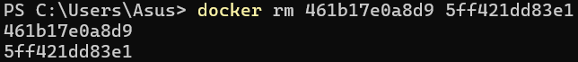
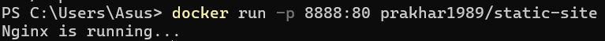

# Getting Started

## Setting up your computer
Once you are done installing Docker, test your Docker installation by running the following:  

# Hello World

## Playing with Busybox
In this section, we are going to run a Busybox container on our system and get a taste of the `docker run` command. To get started, let's run the following in our terminal:  
  
The pull command fetches the Busybox image from the Docker registry and saves it to our system. You can use the `docker images` command to see a list of all images on your system.  

## Docker Run
Let's now run a Docker container based on this image. To do that, we are going to use the almighty `docker run` command.  
  
Behind the scenes, a lot of stuff happened. When you call `run`, the Docker client finds the Busybox, loads up the container, and then runs a command in that container. When we run `docker run busybox`, we didn't provide a command, so the container booted up, ran an empty command, and then exited.  
  
Finally, we see some output. In this case, the Docker client dutifully ran the `echo` command in our Busybox container and then exited it. If you've noticed, all of that happened pretty quickly. The `docker ps` command shows you all containers that are currently running.  
  
Since no containers are running, we see a blank line. Let's try a more useful variant: `docker ps -a`  
  
So what we see above is a list of all containers that we ran. Running the `run` command with the `-it` flags attaches us to an interactive tty in the container. Now we can run as many commands in the container as we want.  
  
Leaving homeless containers will eat up disk space. So, as a rule of thumb, you should clean up containers when you're done working with them. To do this, you can run the `docker rm` command. Just copy the container IDs from above and paste them next to the command.  
  

# Webapps with Docker

## Static Sites
The image that we are going to use is a single-page website that I've already created for the purpose of this demo and hosted on the registry - `prakhar1989/static-site`. We can download and run the image directly in one go using `docker run`. As noted above, the `--rm` flag automatically removes the container when it exits and the `-it` flag specifies an interactive terminal which makes it easier to kill the container with `Ctrl+C`.  
  
Since the image doesn't exist locally, the client will first fetch the image from the registry and then run the image. If all goes well, you should see a "Nginx is running..." message in your terminal. The client is not exposing any ports, so we need to re-run the `docker run` command to publish ports. While we're at it, we should also find a way so that our terminal is not attached to the running container. This way, you can happily close your terminal and keep the container running. This is called detached mode.  
  
In the above command, `-d` will detach our terminal, `-P` will publish all exposed ports to random ports, and finally `--name` corresponds to a name we want to give. Now we can see the ports by running the `docker port [CONTAINER]` command.  
  
You can also specify a custom port to which the client will forward connections to the container.  
  
  
To stop a detached container, run `docker stop` by giving the container ID. In this case, we can use the name `static-site` we used to start the container.  

## Docker Images
Docker images are the basis of containers. In the previous example, we pulled the Busybox image from the registry and asked the Docker client to run a container based on that image. To see the list of images that are available locally, use the `docker images` command.  

## Our First Image
It's time to create our own image. Our goal in this section will be to create an image that sandboxes a simple Flask application. For the purposes of this workshop, I've already created a fun little Flask app that displays a random cat .gif every time it is loaded. If you haven't already, please go ahead and clone the repository locally like so:  
  
The next step now is to create an image with this web app. As mentioned above, all user images are based on a base image. Since our application is written in Python, the base image we're going to use will be Python 3.

## Dockerfile
Now that we have our Dockerfile, we can build our image. The `docker build` command does the heavy lifting of creating a Docker image from a Dockerfile.  

## Docker Push
If this is the first time you are pushing an image, the client will ask you to login. Provide the same credentials that you used for logging into Docker Hub.  
  
To publish, just type the below command remembering to replace the name of the image tag above with yours. It is important to have the format of `yourusername/image_name` so that the client knows where to publish.  

# Multi-container Environments

## Food Trucks
First up, let's clone the repository locally.  
  
Let's think of how we can Dockerize the app. We can see that the application consists of a Flask backend server and an Elasticsearch service. A natural way to split this app would be to have two containers - one running the Flask process and another running the Elasticsearch (ES) process. That way, if our app becomes popular, we can scale it by adding more containers depending on where the bottleneck lies. So we need two containers. We've already built our own Flask container in the previous section. And for Elasticsearch, let's see if we can find something on the hub.  
  
Quite unsurprisingly, there exists an officially supported image for Elasticsearch. To get ES running, we can simply use `docker run` and have a single-node ES container running locally within no time. Let's first pull the image  
  
and then run it in development mode by specifying ports and setting an environment variable that configures the Elasticsearch cluster to run as a single-node.  
  
As seen above, we use `--name es` to give our container a name which makes it easy to use in subsequent commands. Once the container is started, we can see the logs by running `docker container logs` with the container name to inspect the logs. You should see logs similar to below if Elasticsearch started successfully.  
  
  
Finally, we can go ahead, build the image, and run the container.  
  
In the first run, this will take some time as the Docker client will download the Ubuntu image, run all the commands, and prepare your image. Re-running `docker build` after any subsequent changes you make to the application code will almost be instantaneous. Now let's try running our app.  
  
Oops! Our Flask app was unable to run since it was unable to connect to Elasticsearch.

## Docker Network
Okay, so let's run `docker container ls` and see what we have.  
  
Now is a good time to start our exploration of networking in Docker. When Docker is installed, it creates three networks automatically.  
  
The bridge network is the network in which containers are run by default. So that means that when I ran the ES container, it was running in this bridge network. To validate this, let's inspect the network.  
  
Let's first go ahead and create our own network.  
  
The `network create` command creates a new bridge network, which is what we need at the moment. In terms of Docker, a bridge network uses a software bridge which allows containers connected to the same bridge network to communicate, while providing isolation from containers which are not connected to that bridge network. The Docker bridge driver automatically installs rules in the host machine so that containers on different bridge networks cannot communicate directly with each other. Now that we have a network, we can launch our containers inside this network using the `--net` flag. Let's do that - but first, in order to launch a new container with the same name, we will stop and remove our ES container that is running in the bridge network.  
  
Let's launch our Flask container for real now:  

## Docker Compose
The first step is to install Docker Compose. If you're running Windows or Mac, Docker Compose is already installed as it comes in the Docker Toolbox. Since Compose is written in Python, you can also simply do `pip install docker-compose`. Test your installation with:  
  
Now we can run `docker-compose`. Navigate to the food trucks directory and run `docker-compose up`.  
  
First off, let us stop the services from running. We can always bring them back up in just one command. Data volumes will persist, so it’s possible to start the cluster again with the same data using `docker-compose up`. To destroy the cluster and the data volumes, just type `docker-compose down -v`.  
  
While we're at it, we'll also remove the foodtrucks network that we created last time.  
  
Now that we have a clean slate, let's re-run our services and see if Compose does its magic.  
  
So far, so good. Time to see if any networks were created.  
  
You can see that Compose went ahead and created a new network called `foodtrucks_default` and attached both the new services in that network so that each of these are discoverable to the other. Each container for a service joins the default network and is both reachable by other containers on that network, and discoverable by them at a hostname identical to the container name.  

